# 10) Le système récolte des signatures sur le portail e-Gov genevois
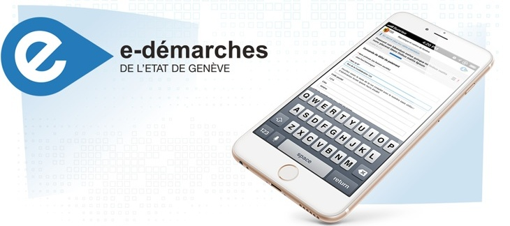

## Notre proposition 

Le canton de Genève souhaite développer une démarche en ligne d'e-collecting qui s'intègre directement dans le portail e-Gov (e-démarche à Genève) du canton. Cette prestation permettra d'offrir aux citoyennes et citoyens du canton un canal électronique, en plus du canal papier, qui s'interfacera à l'application genevoise de contrôle des signatures d'initiatives (IN) et de référendums (REF). 

Les personnes s'authentifieront avec leur identité électronique (e-ID), pour apporter leur soutien aux IN et/ou REF, pour lesquels ils disposent des droits politiques. Les autorités valideront automatiquement et en temps réel les droits de la personne, ainsi que l'unicité de la signature. 

Cette solution en mains publiques garantit un accès 24h/24, élimine la fraude tout en préservant le choix entre les canaux papier et digital, rendant la démocratie directe véritablement accessible à tous, y compris aux personnes en situation de handicap et aux Suisses de l'étranger.

### Objectifs
- Permettre un accès direct sans recours à des tiers
- Restaurer la confiance dans la récolte des signatures
- Offrir un outil garantissant l'autonomie des personnes en situation de handicap
- Offrir un accès 24h/24 aux récoltes des signatures en cours
- Permettre aux Suisses de l'étranger (SE) d'apporter un soutien pour un objet 
- Rétablir l'égalité des chances entre les petits et les grands comités

### Philosophie
- Solution qui doit être en mains publiques, car c'est une tâche régalienne
- Conjuguer récolte traditionnelle papier et récolte électronique 
- Proposer une solution qui soit simple d'utilisation tant pour les comités que les électrices et électeurs
- Toujours avoir le choix des canaux de récolte (papier, électronique) tant pour les comités que les électrices et électeurs 
- Diminuer la dépendance à des tiers (sociétés de récolte de signatures)

### Approche
- Accès via la plateforme Egov du canton de Genève (e-démarches) qui permet notamment aux genevoises et genevois de faire leur déclaration fiscale. Haut niveau de sécurité via une authentification forte et une identité vérifiée
- Registre électoral centralisé dans le canton de Genève
- Connexion via e-ID cantonale et ultérieurement e-ID fédérale
- Optimiser les coûts et l'expérience utilisateur : en utilisant les infrastructures IT de l'Etat de Genève et une gestion d'identité existante pour les personnes : e-démarches
- Pas de secret de la signature ou du soutien électronique. Signer ou soutenir un objet pour qu'il rentre dans l'agenda politique ne signifie pas que l'on va forcément voter en faveur de cet objet 

### Identification des acteurs
- Électrices et électeurs 
- Comités référendaires ou initiatives
- Canton : chancellerie d'État 
- Communes 
- Chancellerie fédérale

### Concept
Électrices et électeurs peuvent apporter leurs soutiens digitaux aux objets pour lesquels ils disposent des droits politiques :
- **Personnes suisses** : fédéral, cantonal et communal : la commune de résidence (À GE les SE n'ont pas les droits politiques au niveau communal)
- **Personnes sous curatelle de portée générale** : cantonal et communal
- **Personnes étrangères résidantes depuis 8 ans** : communal dans la commune de résidence

La personne ne peut soutenir que les référendums et les initiatives pour lesquels elle dispose des droits. Grâce à ce système, il n'y a dès lors que des soutiens/signatures valables. Cela simplifie :
- les contrôles des autorités
- le calcul du nombre de signatures valables requises pour les comités qui n'ont plus de surprises pour les soutiens électroniques 

Mise à jour du système de contrôle des signatures valables pour ajouter un canal digital qui s'agrégera avec le canal papier, à l'instar de ce qui existe pour le vote électronique avec les deux autres canaux traditionnels.

Destruction des données conformément à la LEDP. 

Système de récolte en ligne sur la plateforme web ge.ch et pas d'utilisation d'APP sur Google ou Applestore :
- Pour ne pas avoir de dépendance à un système US
- Pour ne pas avoir de frais de maintenance récurrents à toute APP
  
## Pitch de la solution
<a href="docs/presentation_PITCH_-recolte-signatures-V2.pdf">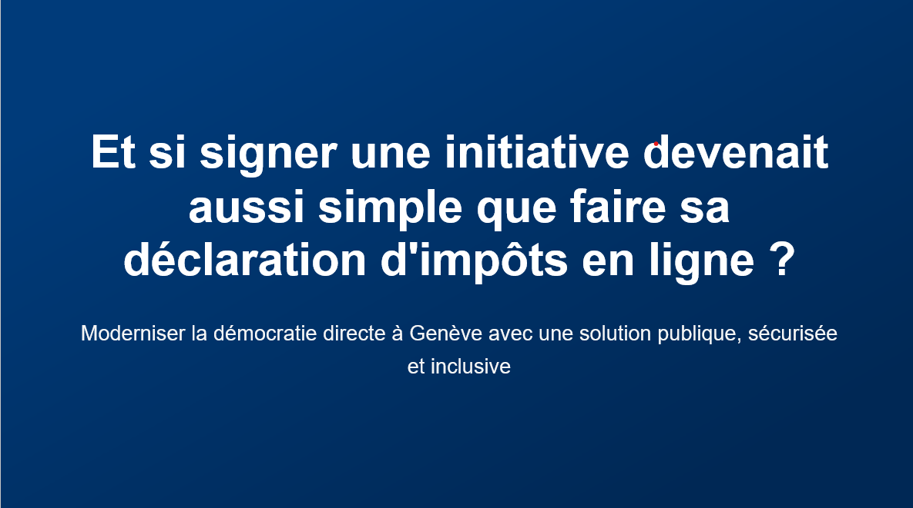</a>
Présentation disponible en cliquant sur l'image.

## Documentation et Diagrammes
### Architecture : plateforme e-Gov et applicatif contrôle des signatures
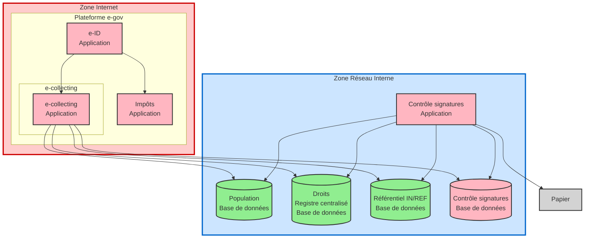
<b> Présentation du processus de signature en ligne</b>
<a href="https://ai.leclere.ch/e-collecting/" target="_blank">Démo</a>

### Flowchart: E-collecting : Parcours utilisateur - nominal
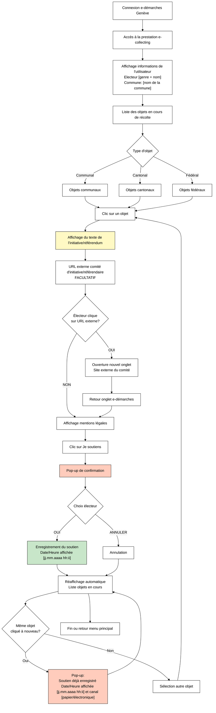

### Flowchart : Dénonciation d'une fraude à la signature papier
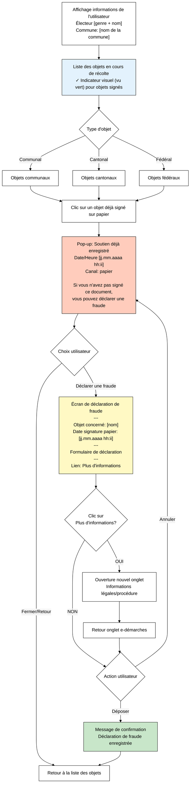

### Flowchart: traitement des initiatives / référendum papier

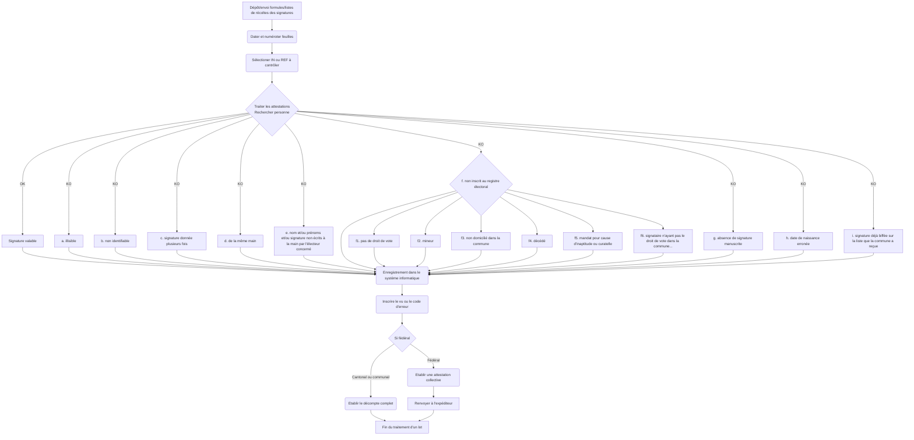

## User Experience
Présentation de l'expérience utilisateur étapes par étapes :

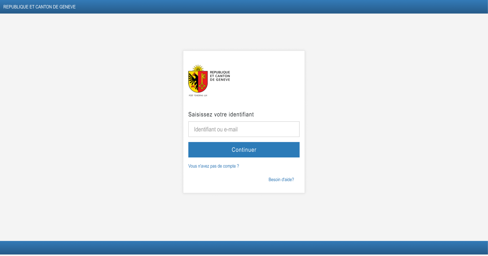
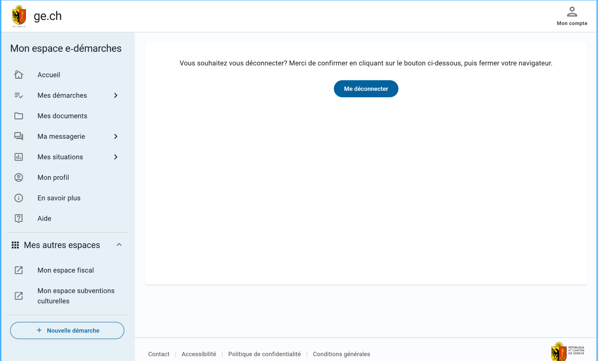

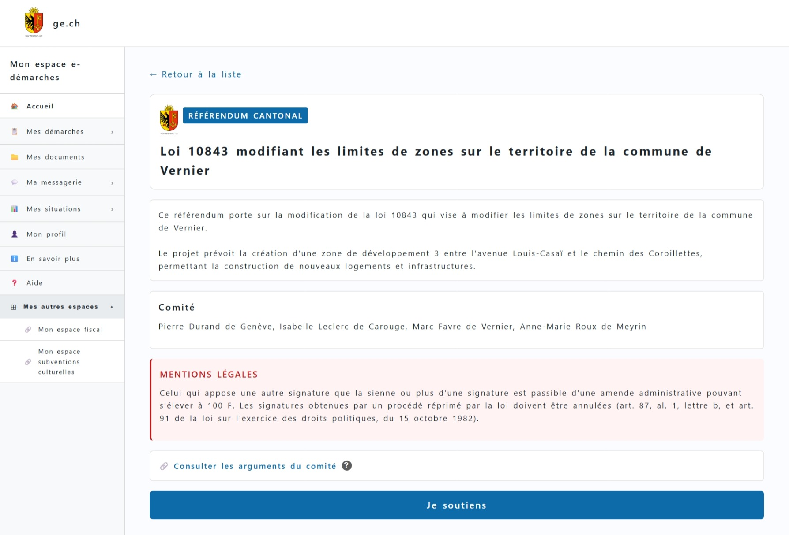
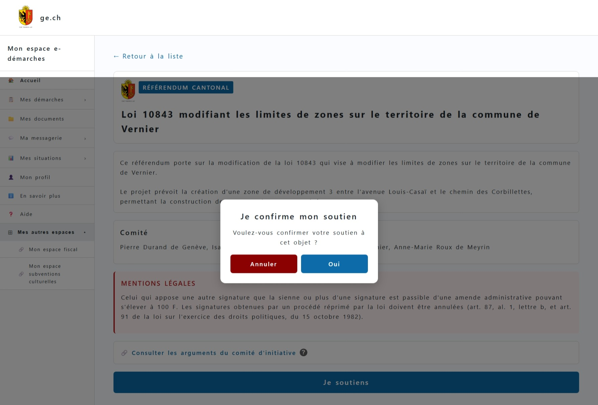
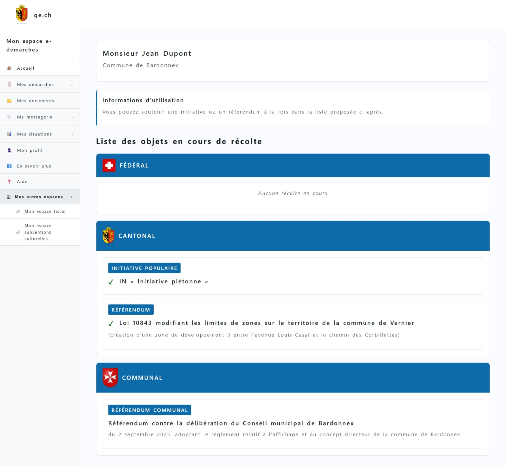
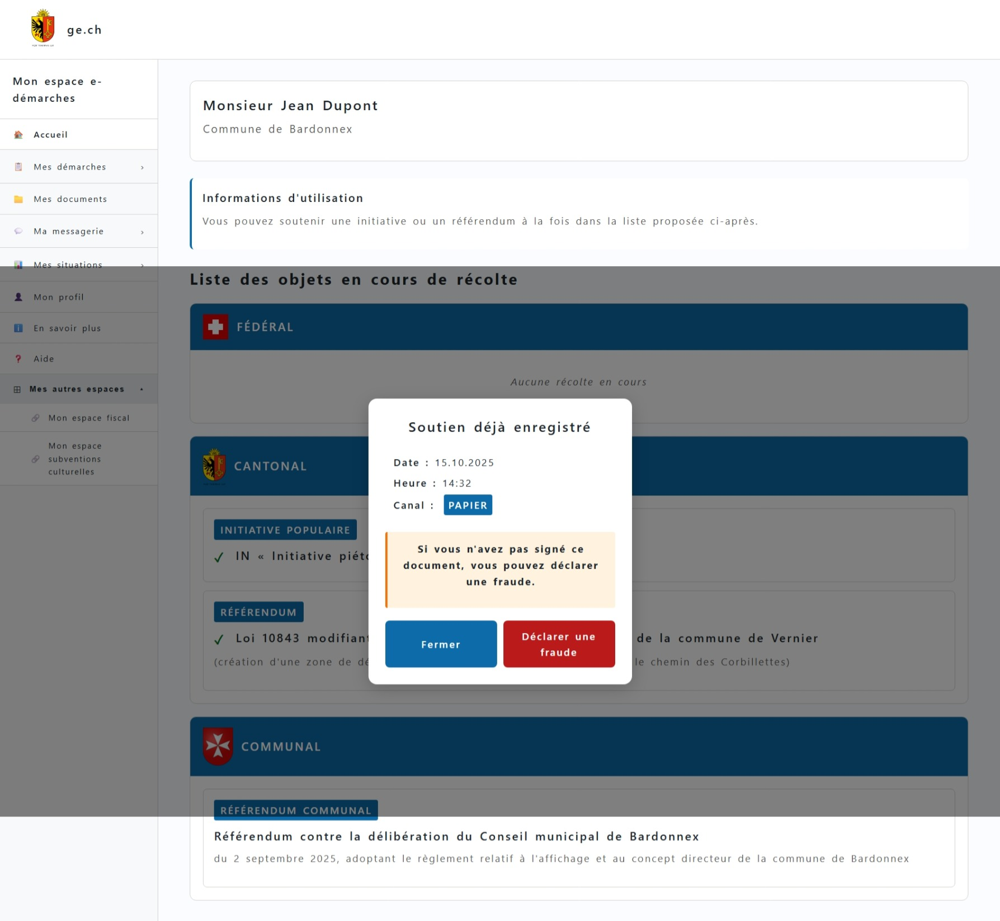

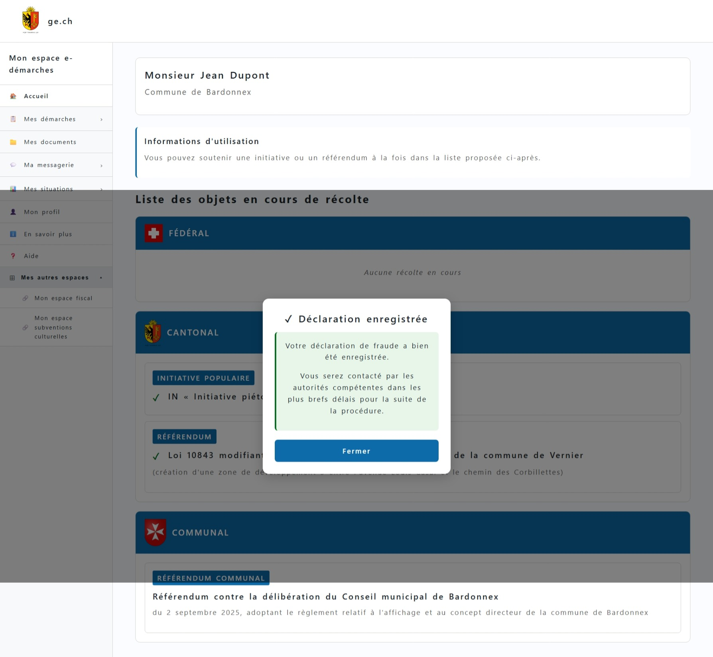
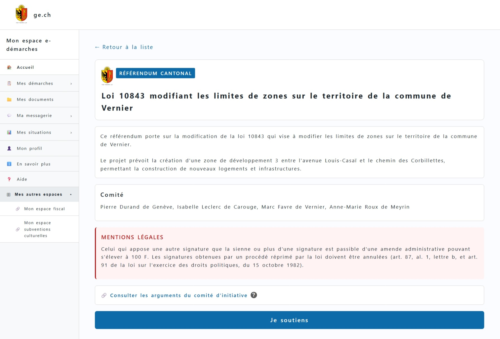

## Topics addressed

# Tableau des Topics

| Topic | Titre | Comment la solution proposée répond |
|-------|-------|-------------------------------------|
| 1 | « De la volonté de soutien à la déclaration de soutien » | Le comité pourra déposer une demande de lancement d'IN ou de REF en ligne. Après validation par la chancellerie et publication dans la feuille d'avis officielle (FAO), la récolte de soutiens pourra être ouverte en ligne. (cf. portail mandataire, ce thème ne sera pas couvert durant le hackathon)  Le dépôt d'un soutien via l'e-collecting se fait uniquement au travers du device de la personne citoyenne ou du citoyen même dans la rue.  Il ne faut pas dupliquer le formulaire papier en ligne sur du digital dans la rue.   <i>Réflexion en cours sur l'utilisation de QR code, pour accéder au formulaire de récolte sur la plateforme e-Gov genevoise.</i> |
| 2 | « Accès aux informations concernant les déclarations de soutien déposées » | Le comité pourra connaitre le nombre de signatures valables récoltées en ligne.   <b>Pas d'agrégation des signatures papier et électronique.</b> Pas de transmission d'informations concernant les informations géographiques ou les motifs d'invalidité <b>(il ne peut pas y avoir de soutiens non-valables en ligne)</b>. Les motifs d'invalidité sont sujets à recours à GE et sont du ressort du Conseil d'Etat. |
| 3 | « Attribution des attestations de soutien aux comités et aux entreprises de récolte » | Au niveau cantonal/communal à Genève cette problématique n'existe pas. <i>Pour le niveau fédéral, c'est un sujet à discuter.</i> Une solution de type auto-complétion permettant de récupérer des saisies faites par d'autres personnes peut être envisagée. |
| 4 | « Diffusion des arguments des comités via le logiciel de récolte électronique de signatures » | Les arguments du comité sont un point de vigilance dans la solution. Problématique du lien url du comité non maîtrisé par les autorités. Il faut indiquer que les autorités ne sont pas responsables des informations publiées par le comité. Réflexions en cours pour proposer une redirection sur url du comité ou pour ne proposer que des pdf non modifiables mais accessibles pour les personnes en situation de handicap. Cela nécessite de la part des comités de réaliser des pdf accessibles. <b>C'est une question actuellement ouverte.</b> |
| 5 | « Exclusion des attestations de soutien illicites » | La personne s'identifie sur le portail e-Gov cantonal à l'aide d'une identité électronique. La solution d'e-collecting sera connectée directement, via des webservices, au back-office cantonal de contrôle des signatures et au rôle électoral.  Les personnes pourront soutenir que les IN/REF pour lesquelles elles ont les droits politiques.  Sur la base de la première signature enregistrée (papier ou électronique), la personne pourra apporter son soutien qu'une seule fois. |
| 6 | « Prévention des attestations de soutien non dépouillées » | La ChF doit définir la méthode de transmission des soutiens électroniques par exemple nous proposerions un échange chiffré de données à l’instar de ce qui était fait pour le e-voting. |
| 7 | « Respect du secret du vote » | Selon notre interprétation, il y a une erreur de terminologie concernant le secret du vote, il s'agit en réalité du <b>secret de la signature</b>. Apposer sa signature n'est pas un équivalent à un vote. En effet, on peut soutenir en apportant sa signature, la mise à l'agenda politique sans forcément voter et/ou au final voter en faveur de l'objet lorsqu'il sera soumis en votation.  L'avantage de la solution en ligne est que seul le canton ou la commune connait l'identité de la personne qui a apporté son soutien. Les données concernant le signataire ne sont pas à disposition des comités contrairement au processus papier, on respecte ainsi la protection des données des personnes  <b>= Niveau 0 </b>|
| 8 | « Intégration avec le processus papier » | Actuellement toutes les signatures papier sont enregistrées dans un système informatique dédié. Elles sont ensuite détruites en l'absence de recours selon le droit en vigueur. Les signatures en ligne seront enregistrées dans le même système dédié via un interfaçage. Les signatures récoltées en ligne seront également détruites. L'e-collecting genevois sera une fonctionnalité supplémentaire à celles offertes, par le logiciel de contrôle des signatures papier. Il s'agit de la même approche que pour le e-voting et les autres canaux de votes. |
| 9 | « Introduction facilitée pour les communes avec un gain d'efficacité ; sur la base des infrastructures et des processus existants » | À Genève, le contrôle des signatures, au niveau fédéral, cantonal et communal, est centralisé entièrement au niveau du canton. |
| 10 | « Récolte électronique pour tous les niveaux fédéraux » | Idem 9 |

## Key Strenghts and Weaknesses

### Strengths / Forces de la solution proposée :
* Utilisation d’infrastructures existantes moyennant une adaptation des SI. Pas besoin de créer des infrastructures. Il s'agit d'une optimisation des ressources existantes.

* Conforme au droit cantonal – le canton de Genève a une disposition expérimentale dans la LEDP qui lui permet de faire des tests notamment en matière digitale. Il n’est donc pas nécessaire d’adapter les bases légales cantonales pour débuter les essais au niveau cantonal et communal

* Suivi en temps réel des soutiens digitaux récoltés – communication du nombre aux comités

* L’électeur voit les objets pour lesquels il a apporté un soutien pour une mise à l’agenda politique

* Les personnes ne peuvent pas soutenir/signer plus d’une fois au niveau digital, contrairement au papier. La première signature enregistrée pour une personne bloque tout autre enregistrement papier ou électronique.

* Réduction de la fraude

* Participation des Suisses de l'étranger : facilitation pour les expatriés inscrits

* Autonomie des personnes en situation de handicap

* Choix offert aux électeurs : digital ou papier
  
* Protection des données des signataires : seule l'administration a connaissance de l'identité de la personne 

* Planification budgétaire : coûts prévisibles vs coûts variables des sociétés de récolte

* Continuité de la démocratie directe en cas de crise sanitaire (cf. COVID)

* Inclusion des jeunes : génération <i>Digital Native</i> plus encline à participer sur des canaux digitaux que papier

* Pas de dépendance à une entreprise US

* Pas de frais de maintenance liée à un APP

### Weaknesses / Faiblesse de la solution proposée :
* Système basé sur un registre centralisé, si des cantons ou des communes souhaitent reprendre le concept, il est nécessaire d’avoir un registre électoral qui soit au final centralisé au niveau du canton ou au niveau fédéral.

### Weaknesses / Faiblesses pour le Ecollecting en général  :
* Pression sociale digitale : risque de campagnes de harcèlement en ligne pour signer

* Confidentialité perçue : même si légal, certains citoyens peuvent craindre la traçabilité numérique

* Résistance culturelle : attachement au rituel de la signature papier en rue. Moins de mobilisation de terrain = moins de débat public ?

* Polarisation accrue : facilitation = plus d'objets = saturation de l'agenda politique ?

* Support utilisateur : hotline/FAQ à dimensionner correctement. Coûts à prévoir. 

* Risque d’augmentation du nombre d’aboutissement des initiatives et de référendums et donc d'encombrement de l'agenda politique

* Risque de lassitude des électrices et électeurs

## Getting Started

*These instructions will get you a copy of the technical prototype (if applicable) up and running on your local machine for development and testing purposes. **If you are not developing a technical prototype, please present or reference your conceptual and/or clickable prototype.***

### Prerequisites

*What things you need to install the software and how to install them.*

### Installation

*A step by step series of examples that tell you how to get a development env running.*

## Contributing

Please read [CONTRIBUTING.md](/CONTRIBUTING.md) for details on our code of conduct.

## Team Members

- Valérie Vulliez Boget/GitHub Account (role)
- Olivier Leclère / OlivierLeclereGE
- Lucia Italiano/luciaitaliano73-oss (UX and Digital Governance)
- Stefan Christen

## License

This software is licensed under a AGPL 3.0 License - see the [LICENSE](LICENSE) file for details. Please feel free to [choose any other](https://choosealicense.com/) [Open Source Initiative approved license](https://opensource.org/licenses) (e.g. a permissive license such as [MIT](https://opensource.org/license/mit)). Other content (e.g. text, images, etc.) is licensed under a [Creative Commons CC BY-SA 4.0 license](https://creativecommons.org/licenses/by-sa/4.0/deed.de). Exceptions are possible in consultation with the organizers.
