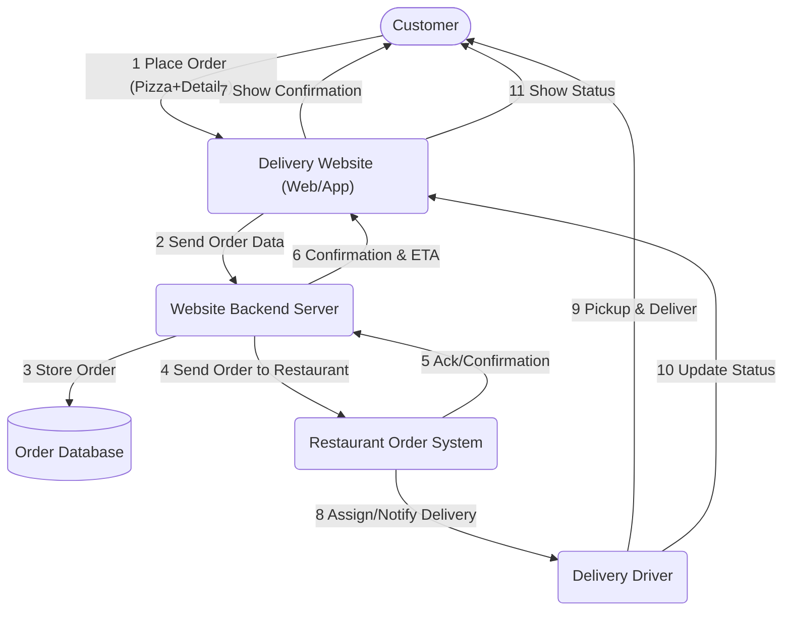
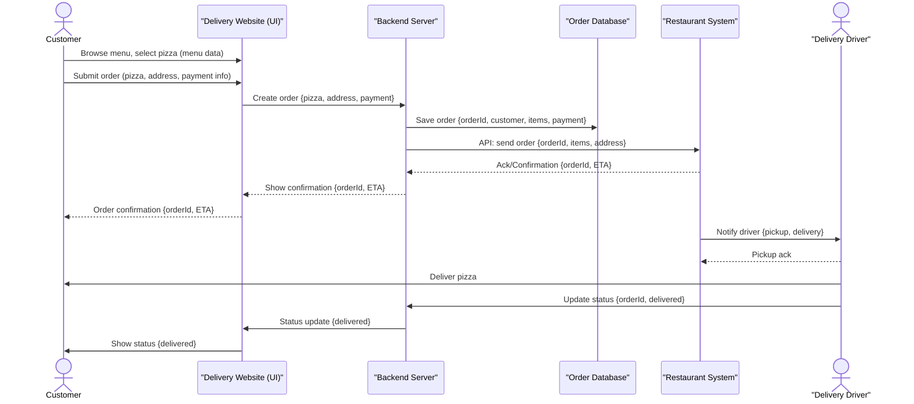

# 10) Le système récolte des signatures sur le portail Egov genevois

*Over the course of two days, you will develop your solution for collecting electronic signatures for popular initiatives and referendums from A to Z, addressing the 10 topics outlined in the [guidelines](https://www.bk.admin.ch/bk/de/home/politische-rechte/e-collecting/aktuelles.html). Your prototype can be conceptual, clickable, and/or technical. Either way, you should clearly present the interactions and data flows between actors, software, and infrastructure components over time, as well as the user experience of these actors.*

## Approach

Le canton de Genève souhaite développer une démarche en ligne d'e-collecting qui s'intègre directement dans le portail e-Gov (e-démarche à Genève) du canton. Cette prestation permettra d'offrir aux citoyennes et citoyens du canton un canal électronique, en plus du canal papier, qui s'interfacera à l'application genevoise de contrôle des signatures d'initiatives (IN) et de référendums (REF). 

Les personnes s'authentifieront avec leur identité électronique (e-ID), pour apporter leur soutien aux IN et/ou REF, pour lesquels ils disposent des droits politiques. Les autorités valideront automatiquement et en temps réel les droits de la personne, ainsi que l'unicité de la signature. 

Cette solution en mains publiques garantit un accès 24h/24, élimine la fraude tout en préservant le choix entre les canaux papier et digital, rendant la démocratie directe véritablement accessible à tous, y compris aux personnes en situation de handicap.

### Objectifs
- Permettre un accès direct sans recours à des tiers
- Restaurer la confiance dans la récolte des signatures
- Offrir un outil garantissant l'autonomie des personnes en situation de handicap
- Offrir un accès 24h/24 aux récoltes des signatures en cours
- Permettre aux SE d'apporter un soutien pour un objet 
- Rétablir l'égalité des chances entre les petits et les grands comités

### Philosophie
- Solution qui doit être en mains publiques, car c'est une tâche régalienne
- Conjuguer récolte traditionnelle papier et récolte électronique 
- Proposer une solution qui soit simple d'utilisation tant pour les comités que les électrices et électeurs
- Toujours avoir le choix des canaux de récolte (papier, électronique) tant pour les comités que les électrices et électeurs 
- Diminuer la dépendance à des tiers (sociétés de récolte de signatures)

### Approche
- Accès via la plateforme Egov du canton de Genève (e-démarches) qui permet notamment aux genevoises et genevois de faire leur déclaration fiscale. Haut niveau de sécurité via une authentification forte et une identité vérifiée
- Registre électoral centralisé dans le canton de Genève
- Connexion via e-ID cantonale et ultérieurement e-ID fédérale
- Optimiser les coûts et l'expérience utilisateur : en utilisant les infrastructures IT de l'Etat de Genève et une gestion d'identité existante pour les personnes : e-démarche
- Pas de secret de la signature ou du soutien électronique. Signer ou soutenir un objet pour qu'il rentre dans l'agenda politique ne signifie pas que l'on va forcément voter en faveur de cet objet 

### Identification des acteurs
- Électrices et électeurs 
- Comités référendaires ou initiatives
- Canton : chancellerie d'État 
- Communes 
- Chancellerie fédérale

### Concept
Électrices et électeurs peuvent apporter leurs soutiens digitaux aux objets pour lesquels ils disposent des droits politiques :
- **Personnes suisses** : fédéral, cantonal et communal : la commune de résidence (À GE les SE n'ont pas les droits politiques au niveau communal)
- **Personnes sous curatelle de portée générale** : cantonal et communal
- **Personnes étrangères résidantes depuis 8 ans** : communal dans la commune de résidence

La personne ne peut soutenir que les référendums et les initiatives pour lesquels elle dispose des droits. Grâce à ce système, il n'y a dès lors que des soutiens/signatures valables. Cela simplifie :
- les contrôles des autorités
- le calcul du nombre de signatures valables requises pour les comités qui n'ont plus de surprises pour les soutiens électroniques 

Mise à jour du système de contrôle des signatures valables pour ajouter un canal digital qui s'agrégera avec le canal papier, à l'instar de ce qui existe pour le vote électronique avec les deux autres canaux traditionnels.

Destruction des données conformément à la LEDP. 

Système de récolte en ligne sur plateforme web ge.ch et pas d'utilisation d'APP sur Google ou Applestore :
- Pour ne pas avoir de dépendance à un système US
- Pour ne pas avoir de frais de maintenance récurrents à toute APP

## Documentation and Diagrams

*Together, you will contribute to comparing different ways of how to implement e-collecting in Switzerland from A to Z. As part of the [participatory process](https://www.bk.admin.ch/bk/de/home/politische-rechte/e-collecting/partizipativer_prozess.html), your solutions will be discussed in subsequent workshops and will possibly be taken into account for the official decision on the design of the federal e-collecting trials. Proper documentation is key to ensuring that your solution can be understood and evaluated:*

1. **[Mermaid](https://mermaid.js.org/) diagram(s) showing interactions and data flows between actors, software and infrastructure components of your solution over time.**
2. **Wireframes or mockups with user flow showing the user experience of different actors** (using e.g. Figma)
3. Explain how you addressed the topics presented in the [guidelines](https://www.bk.admin.ch/bk/de/home/politische-rechte/e-collecting/aktuelles.html), filling in the template below.
4. List the key strengths and weaknesses of your solution.
5. Explanation of features used (if applicable)
6. A requirements file with all packages and versions used (if applicable)
7. Environment code to be run (if applicable)

*For your reference, you will find below an example of two diagrams showing interactions and data flows between actors, software and infrastructure components of ordering a pizza via a third-party delivery website over time. Please replace them with diagrams for your solution.*

### Flowchart: High-level Process (Example)

*An overall process flow showing the main steps and system/actor interactions for ordering a pizza online via a delivery website, including software, infrastructure, and handoff to the restaurant and delivery driver.*

### Sequence Diagram: Detailed Interactions & Data Flows (Example)

*A step-by-step illustration showing how data and requests are exchanged between actors (customer, delivery site, restaurant, infrastructure), and key software components in the order process.*

## User Experience

*Add or reference wireframes or mockups with user flow showing the user experience of different actors.*

## Topics addressed

*Explain how you addressed the topics presented in the [guidelines](https://www.bk.admin.ch/bk/de/home/politische-rechte/e-collecting/aktuelles.html), filling in the template below.*

| Topic | (How) is it addressed? |
| -| ------- |
| 1 |  |
| 2 |  |
| 3 |  |
| ... |  |

## Key Strenghts and Weaknesses

*List the key strengths and weaknesses of your solution.*

### Strengths:
- ...
- ...

### Weaknesses:
- ...
- ...

## Getting Started

*These instructions will get you a copy of the technical prototype (if applicable) up and running on your local machine for development and testing purposes. **If you are not developing a technical prototype, please present or reference your conceptual and/or clickable prototype.***

### Prerequisites

*What things you need to install the software and how to install them.*

### Installation

*A step by step series of examples that tell you how to get a development env running.*

## Contributing

Please read [CONTRIBUTING.md](/CONTRIBUTING.md) for details on our code of conduct.

## Team Members

- Valérie Vulliez Boget/GitHub Account (role)
- Olivier Leclère / OlivierLeclereGE
- Name/GitHub Account (role)
- ...

## License

This software is licensed under a AGPL 3.0 License - see the [LICENSE](LICENSE) file for details. Please feel free to [choose any other](https://choosealicense.com/) [Open Source Initiative approved license](https://opensource.org/licenses) (e.g. a permissive license such as [MIT](https://opensource.org/license/mit)). Other content (e.g. text, images, etc.) is licensed under a [Creative Commons CC BY-SA 4.0 license](https://creativecommons.org/licenses/by-sa/4.0/deed.de). Exceptions are possible in consultation with the organizers.
